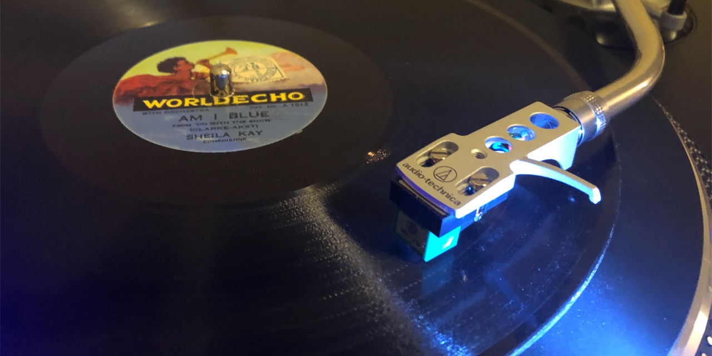
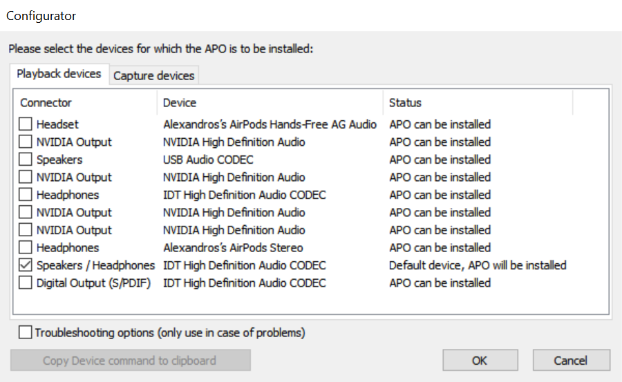
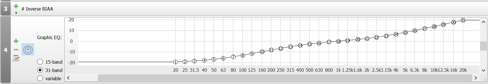
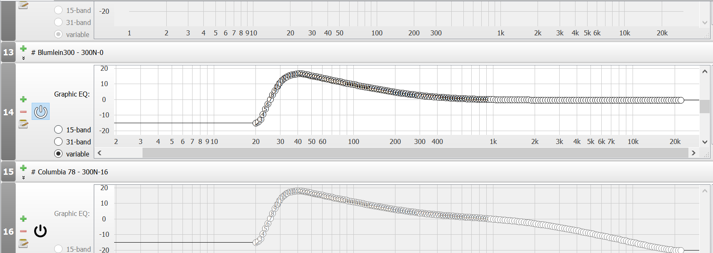
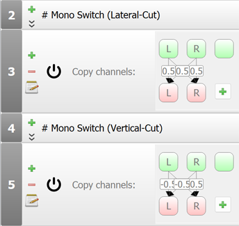

This library of equalization curves allows you to listen to 78 rpm records with correct equalization in real time. Playback may be done using any program, as the correction to equalization is done using the [Equalizer APO](https://sourceforge.net/projects/equalizerapo/) system-wide equalizer (Windows required). You can also use these filters to listen to raw transfers enjoyably.

<a href="https://github.com/agkozak/78curves/archive/master.zip" class="button">DOWNLOAD</a>

## Table of Contents

* [Introduction](#introduction)
* [Installing Equalizer APO](#installing-equalizer-apo)
* [Installing the Library of EQ Curves](#installing-the-library-of-eq-curves)
* [Using the Curves](#using-the-curves)
* [Curves Included](#curves-included)
* [Mono Switch](#mono-switch)
* [Appendix: Playing Records Through Audacity](#appendix-playing-records-through-audacity)

## Introduction

In 1925, when phonograph records began to be recorded electrically, sound engineers ran into a problem: if bass frequencies exceeded a certain volume, the grooves of a record would not be wide enough to contain them. The cutter that made the record would overcut and the grooves would run together. Instead of opting for wider grooves (which would have the undesirable effect of shortening playing time), engineers began to reduce the amplitude of low frequencies with the expectation that playback equipment would adjust accordingly. Soon they discovered that increasing the amplitude of higher frequencies on the disc and de-emphasizing them during playback had the effect of suppressing surface noise and preserving sounds that might otherwise be lost, such as sibilants.

These adjustments between the encoding of sound on a record and the transformation it undergoes during playback are known as equalization. For several decades, many equalization curves were in use, with individual record labels using different standards and even changing their standards from year to year. Even with the move from 78s to LPs and 45s, various standards were in use.

By 1955, the United States had adopted the RIAA standard for sound recording; the rest of the world would eventually follow suit. To this day, most phono preamps apply the RIAA equalization curve to their output, which results in many 78s sounding rather muffled during playback. A common solution is to record a disc and then equalize it correctly soon afterwards. There are complications: modern equipment tends to reproduce all too faithfully the irritating surface noise of early 78s, which means that the collector will have to declick, decrackle, and even denoise each recording to make it listenable, perhaps even applying a low pass filter to deemphasize high-frequency noise well above the range of meaningful sound. One of the best software solutions to facilitate these sorts of 78 transfers is [Audacity](https://www.audacityteam.org/), which happens to have [a wiki](https://wiki.audacityteam.org/wiki/78rpm_playback_curves#78_rpm_shellac_labels_and_their_EQ) that nicely documents many of the historical equalization curves.

Unfortunately, this solution means that the collector never gets to enjoy the records fully in real time. My solution to this problem is to draw upon the wealth of research that the Audacity team has done, but to use filters that can be used by a system-wide equalizer so that a record can be enjoyed while it spins. [Equalizer APO](https://sourceforge.net/projects/equalizerapo/) for Windows allows one to combine more than one EQ curve, so it is what I have used.

## Installing Equalizer APO

To use the EQ curves, you must first download [Equalizer APO](https://sourceforge.net/projects/equalizerapo/). After installing it, you will have to reboot your computer for the system-wide equalizer to work. The program is usually installed to `C:\Program Files\EqualizerAPO`. The configuration files are kept in `C:\Program Files\EqualizerAPO\config`.

During installation, you will be asked which playback devices you would like Equalizer APO's filters to be applied to. Put check marks next to the relevant devices, e.g.

If you want to change these settings at a later date, you can do so by using the Configurator in the Equalizer APO folder in your Start Menu.

## Installing the Library of EQ Curves

You can download the whole library of curves [as a ZIP file](https://github.com/agkozak/78curves/archive/master.zip) or using Git (from `https://github.com/agkozak/78curves`). Unzip the archive into the Equalizer APO configuration directory (`C:\Program Files\EqualizerAPO\config`). Please note that if you have already been using and have configured Equalizer APO, you may already have a `config.txt` file; please be sure to save it somewhere, as it will be overwritten.

## Using the Curves

Open the Configuration Editor from your Start Menu (you will find it in the Equalizer APO folder). It is the Configuration Editor that manages your `config.txt` configuration file.

The `config.txt` file already contains all of the EQ curves in this library. To keep things simple, you may eventually choose to remove from it any curves that you do not need. If you want to restore an individual curve, you may do so by creating a 31-band graphic equalizer in Equalizer APO and then importing the relevant `.csv` file from your configuration directory.

To play any given record with the correct equalization, go through the following steps:

First determine if the sound coming from your preamp has an RIAA curve imposed on it. It usually does; nearly all preamps (whether internal or external to the record player) use the RIAA curve, making an old shellac record sound rather muffled. In this case, you will want to turn on the *Inverse RIAA* curve, which will be the second item down in Equalizer Pro -- this will have the effect of undoing the RIAA equalization:

Now that you are sure that your audio input is flat, it is time to impose the correct curve. If you need to, consult the [Audacity Wiki](https://wiki.audacityteam.org/wiki/78rpm_playback_curves#78_rpm_shellac_labels_and_their_EQ) to find the curve appropriate to the record you are playing. Turn on the relevant filter:

In the example above, Blumlein300 has been enabled; note that Columbia 78 below it is turned off. You will not generally want to enable more than one historical EQ curve.

Start playing the record and see how it sounds. Equalizer APO does not play records -- you will need other software to do that (I use Audacity with monitoring turned on; [see below](#appendix-playing-records-through-audacity) for a how-to). Most older shellac records from the 1920s and 1930s have a great deal of surface noise (mostly clicks and crackle). You will probably not want to hear the higher-frequency noise. Turn on and adjust the high-shelf filter (the first item in Equalizer Pro) to suppress some of the high-frequency noise:

If you get it right, all of the harsh clicks and crackle will become more pleasant to listen to (without too much muffling of the music itself). For some later records, you can turn off the filter entirely.

Note that you can also use these techniques to listen to raw transfers enjoyably. Just make sure you know whether your transfers are RIAA or flat before you start and adjust the settings accordingly.

**Finally, a warning: Equalizer APO is always running, and it continues to impose its filters even when the Configuration Editor is closed. The only way to get your computer to return to normal is to turn the filters off. You can tell that things have returned to normal when the bottom panel in the Configuration Editor contains a flat line:**

## Curves Included

Two basic curves you may need:

* Inverse RIAA - for flattening out any RIAA curve imposed by your preamp
* RIAA - included just in case you need it

I have made Equalizer Pro equivalents for Audacity's [EQ toolbox for 78 rpm shellacs](https://wiki.audacityteam.org/wiki/78rpm_playback_curves#EQ_Curves_Library):

* 500-FLAT 500N-0
* American 78 - 250N-7 - *Note: Audacity's "American 78" is a compromise between two different real-world curves, 250N-8 (provided below) and 250N-6.*
* BBC 2db/octave (a.k.a. Marconi)
* Blumlein300 - 300N-0
* Columbia 78 - 300N-16
* Decca 78 - 300N-5.5
* European 78 - 250N-0
* Telefunken 400N-0
* Western Electric

Other curves:

* 250N-5
* 250N-8
* AES - 400N-12.3
* Capitol - 400N-12.7
* 500N-5
* 500N-8.5
* MGM - 500N-12
* 500N-13.7
* 500N-16
* 629N-12

Feel free to [open an issue](https://github.com/agkozak/78curves/issues) and ask me to include any other curves that you need. If you are not a GitHub user, you may [contact me through my Elsie Carlisle website](https://www.elsiecarlisle.com/alexandros-kozak/).

## Mono Switch

78 rpm records were recorded in mono, but true mono cartridges are rare and expensive. Many of the ones termed "mono" either have their pins strapped together or achieve something comparable internally, summing the left and right channels of what is really a stereo cartridge and providing identical left and right output. Other solutions involve pre-amps with a mono switch or two "Y" cables plugged together.

78curves provides a software solution to the problem of using stereo equipment to play mono recordings -- the 78curves mono switch:

Turn it on. It is as simple as that. While not as ideal as a true mono cartridge, it should be comparable to any of the other options. Using it should make surface noise less distracting and should diminish the effect of certain flaws, such as peak distortion.

## Appendix: Playing Records Through Audacity

An advantage of using Equalizer APO is that it filters all of the sound going through your playback device, which means that you can use any program you like to actually play the music coming into your sound card.

I like to use [Audacity](https://www.audacityteam.org/) to play my records, especially since I use it when I actually record them. But if you are just playing a record, all you need to do is to "monitor" your sound device without recording a sound file. To do this, click on the little microphone icon in the Audacity toolbar and choose "Start Monitoring":

*Copyright (C) 2020-2021 Alexandros Kozak*
